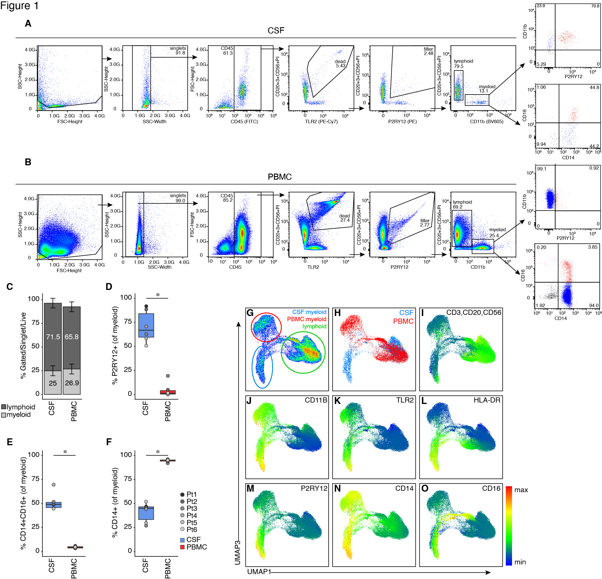

  <a href="../index.html">Home</a>

  <header id="fig-header">
    <h1> CSF-derived myeloid are distinct from periphery and express P2RY12 </h1>
    

    

  </header>

  <main id="fig-main">
    <section id="fig-image-panel">
      {#fig1}
    </section>
      <section id="fig-caption-panel">
      <h3> Figure 1 </h3>
      <ul>
      
        <li>A-B) Flow cytometry of cerebrospinal fluid (CSF) derived cells (A) and peripheral blood mononuclear cells, PBMCs(B).
        <a href="../figs/F1_AB.jpg" target="_blank" rel="noopener"> Check it closer! </a> </li> 
       
        <li>C ) Quantification of the percent of cells in the myeloid or lymphoid gates.
        <a href="../code/F1_C.html" target="_blank" rel="noopener"> View code </a> </li>
        
        <li>D ) Percent of myeloid cells that expressed P2RY12. </li> 
        
       <li>E ) Percent of myeloid cells co-expression CD14 and CD16. </li> 
       
       <li>F ) Percent of myeloid cells CD14+;CD16- 
       <a href="../code/F1_DEF.html" target="_blank" rel="noopener"> View code for D-F </a> </li> 
       
       <li>G-O ) UMAP of FACS data from all 6 subjects with cells from CSF or PBMC (H) and expression of and expression of CD3, CD20 or CD56 (I), CD11B (J), TLR2 (K), HLA-DR (L), P2RY12 (M), CD14 (N) and CD16 (O).
       <a href="../figs/F1_GO.jpg" target="_blank" rel="noopener"> Check it closer! </a> </li> 
       <li> n= 6 paired CSF and PBMC samples analyzed using paired t-test. * p<0.05.

  </ul>
    

