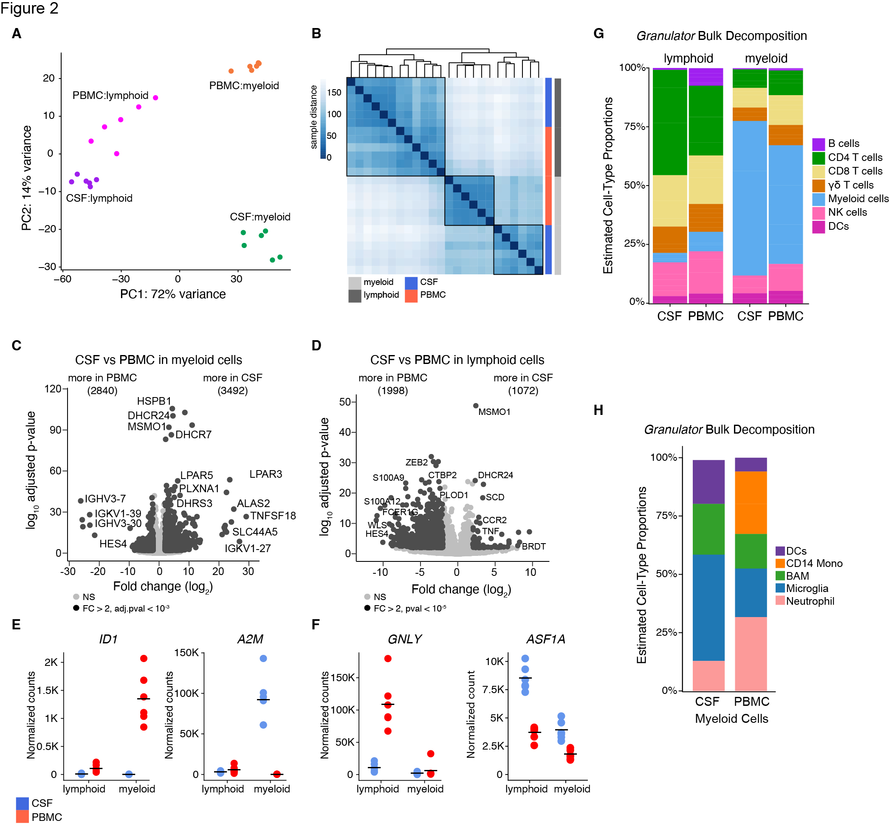

::: {#fig-home-bar}
<a href="../index.html">Home</a>
:::

<header id="fig-header">

<h1>CSF enriched genes in lymphoid and myeloid cells</h1>

</header>

<main id="fig-main">

<section id="fig-image-panel">

{#fig2}

</section>

<section id="fig-caption-panel">

<h3>Figure 2</h3>

<ul>

<li>A ) Principal component analysis of bulk RNA sequencing of CSF-derived cells and PBMCs.
<a href="../code/F2_create.html" target="_blank" rel="noopener"> View code.</a></li>

<li>B ) Euclidean distance analysis of bulk RNA sequencing of CSF and peripheral blood lymphoid and myeloid cells.
<a href="../code/F2_B.html" target="_blank" rel="noopener"> View code.
</a></li>

<li>C ) Volcano plot of differentially expressed genes in myeloid cells between CSF and peripheral blood.
<a href="../figs/F2_C.jpg" target="_blank" rel="noopener"> Check it closer!
</a></li>

<li>D ) Volcano plot of differentially expressed genes in lymphoid cells between CSF and peripheral blood.
<a href="../figs/F2_D.jpg" target="_blank" rel="noopener" style="margin-right:12px;"> Check it closer!
</a>  <a href="../code/F2_CD.html" target="_blank" rel="noopener"> View code.
</a></li>

<li>E ) ID1 and AM2 enriched in myeloid cells in the peripheral blood (left) and CSF (right).</li>

<li>F ) GNLY and PROKR2 enriched in lymphoid cells in the peripheral blood (left) and CSF (right).
<a href="../code/F2_EF.html" target="_blank" rel="noopener"> View code for E and F.
</a></li>

<li>G ) Deconvolution analysis with the R package Granulator of the bulk RNA sequencing lymphoid and myeloid cells from both CSF or peripheral blood.
<a href="../code/F2_G.html" target="_blank" rel="noopener"> View code.
</a></li>

<li>H ) Deconvolution analysis of the bulk myeloid cell samples using the myeloid cell subclusters from single-cell RNA sequencing data.
<a href="pages/Analysis.html">View code</a></li>

<li>

n= 6 paired CSF and PBMC samples of bulk sequenced myeloid and lymphoid cells.

</ul>

